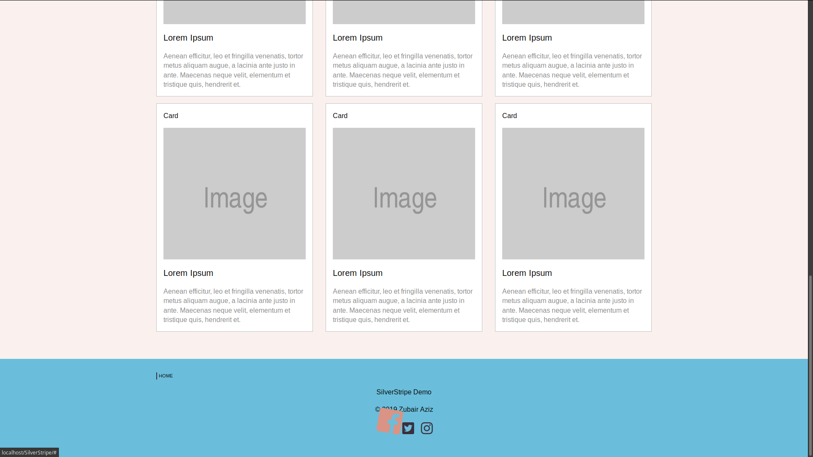

# SilverStripe Demo

by Zubair Aziz

To install, run:

`composer install` then `npm install`.

## Sample Images

## Notes

### Backend

-   Backend work was fairly simple once I've been given the instructions. I really like how Silverstripe manages custom fields, and slugs.

-   I see how collaborating on a team with this platform would be simple.

-   If I had more time, I would try to figure out how to make popup forms for the slider image and caption upload instead of the default way in the tabs.

### Frontend

-   I decided to use Foundation as it was mentioned during the interview, and I've never used this framework before. Perfect time to try it out.

-   Hero slider is based on one of the guides on Zurb Foundation's website (clean hero slider). Orbit slider is really easy to work with, some minor annoying issues with page resizes.

-   Any custom CSS is done with SASS. I just used node to transpile the scss files as opposed to configuring webpack for the entire project.

-   If I had more time I'd work more on a thematic presentaton for the page. Actually take time in figuring out page composition and color theming. Rely less on Foundation and write more custom CSS.

-   At the moment, I think it meets minimum standards for mobile platforms. But I could've worked more on making it look better on smaller screens (i.e. adding a hamburger menu)

-   I was also playing around with CSS Animations. I think the animation for the floating (footer) icons looks really cool.

### (Possible) Bugs

-   Hero slider does'nt show up immediately. I probably could've just instantiate the height of image slider on initial page load and implemented some type of lazy loading on the images.

### Other things

-   I don't know what `phpcs.xml.dist` is exactly for. I left it in the repo, the only changes I made is to add `node_modules` to list of excludes.

-   I decided not to include webpack and babel in this project as I know I'm not using a lot of JavaScript and don't want to spend the time messing with webpack configs.

-   I also exported and included my database for this project. I don't know how necessary that is.
